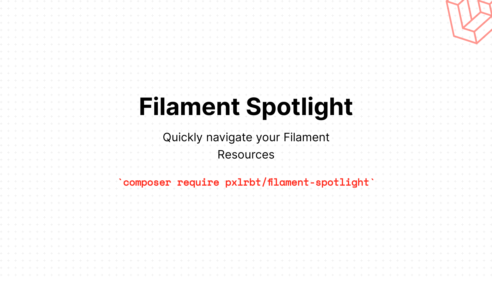

# Filament Spotlight

[](https://packagist.org/packages/pxlrbt/filament-spotlight)
[](LICENSE.md)

[](https://packagist.org/packages/pxlrbt/filament-spotlight)


Quickly navigate your Filament Resources with Spotlight functionality.

Currently supports all pages and resource pages without parameters.

https://user-images.githubusercontent.com/22632550/159757479-ca9c3f46-7638-4889-98ba-6164e5205509.mp4


## Installation

Install via Composer. This will download the package and .

**Requires PHP > 8.0 and Filament > 2.0**

```bash
composer require pxlrbt/filament-spotlight
```

## Usage
There is no configuration needed. It just works.

## Contributing

If you want to contribute to this packages, you may want to test it in a real Filament project:

- Fork this repository to your GitHub account.
- Create a Filament app locally.
- Clone your fork in your Filament app's root directory.
- In the `/filament-spotlight` directory, create a branch for your fix, e.g. `fix/error-message`.

Install the packages in your app's `composer.json`:

```json
"require": {
    "pxlrbt/filament-spotlight": "dev-fix/error-message as main-dev",
},
"repositories": [
    {
        "type": "path",
        "url": "filament-spotlight"
    }
]
```

Now, run `composer update`.

## Credits
- [Dennis Koch](https://github.com/pxlrbt)
- [All Contributors](../../contributors)
- [Wire Elements Spotlight](https://github.com/wire-elements/spotlight)
