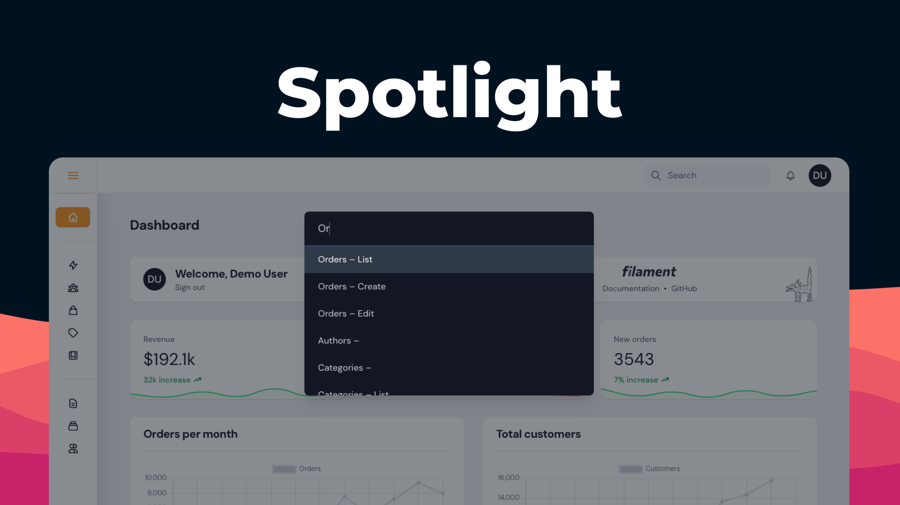

<div class="filament-hidden">


</div>

# Filament Spotlight

<div class="filament-hidden">

[](https://packagist.org/packages/pxlrbt/filament-spotlight)
[](LICENSE.md)

[](https://packagist.org/packages/pxlrbt/filament-spotlight)

</div>

Quickly navigate your Filament Resources with Spotlight functionality.

Supports pages, resources and links from the user menu.

<div class="filament-hidden">

https://user-images.githubusercontent.com/22632550/159757479-ca9c3f46-7638-4889-98ba-6164e5205509.mp4

</div>

## Go Pro!

**Spotlight Pro** is built from the ground up and features a beautiful design that integrates seamlessly with Filament in both light and dark modes. It offers the same easy registration as the default version, along with enhanced control. Learn more at: https://filament.pxlrbt.de/spotlight-pro/


## Installation


| Plugin Version | Filament Version | PHP Version |
|----------------|------------------|-------------|
| 0.x            | 2.x              | \> 8.0      |
| 1.x            | 3.x              | \> 8.1      |
| 2.x            | 3.x, 4.x         | \> 8.1      |


```bash
composer require pxlrbt/filament-spotlight
```

### Upgrade guide for Filament v4

From v2 onwards you will need a [Custom Theme](https://filamentphp.com/docs/4.x/styling/overview#creating-a-custom-theme) to include the Tailwind classes for the Spotlight component. See note below.

### Styles

To include the Tailwind classes that are used in the Spotlight component, you need to create a [Custom Theme](https://filamentphp.com/docs/4.x/styling/overview#creating-a-custom-theme) and include the following line:

```css
@source '../../../../vendor/wire-elements/**/*.blade.php';
```

### Plugin registration

To use this plugin register it in your panel configuration:

```php
use pxlrbt\FilamentSpotlight\SpotlightPlugin;

$panel
    ->plugins([
        SpotlightPlugin::make(),
    ]);
```

## Usage

There is no configuration needed.

> "its genius"

  – Dan Harrin

To open the Spotlight input bar you can use one of the following shortcuts:

CTRL + K
CMD + K
CTRL + /
CMD + /

### Setup

This plugin relies on the same properties and methods used for Filament's global search. For records showing up with the correct name in "Edit/View" you need to set `$recordTitleAttribute`. [Check the docs for more information](https://filamentphp.com/docs/3.x/panels/resources/global-search)

#### Excluding pages

If you need to exclude a page from the spotlight results you may do so by adding a static `shouldRegisterSpotlight` method to the page and return false:

```php
public static function shouldRegisterSpotlight(): bool
{
    return false;
}
```

This can be useful when you have pages that require URL parameters.

## Translation

To translate or edit the default placeholder, you have to publish the translation file for *wire-element/spotlight*:

```php
php artisan vendor:publish --tag=livewire-ui-spotlight-translations
```


## Contributing

If you want to contribute to this packages, you may want to test it in a real Filament project:

- Fork this repository to your GitHub account.
- Create a Filament app locally.
- Clone your fork in your Filament app's root directory.
- In the `/filament-spotlight` directory, create a branch for your fix, e.g. `fix/error-message`.

Install the packages in your app's `composer.json`:

```json
"require": {
    "pxlrbt/filament-spotlight": "dev-fix/error-message as main-dev",
},
"repositories": [
    {
        "type": "path",
        "url": "filament-spotlight"
    }
]
```

Now, run `composer update`.

## Credits
- [Dennis Koch](https://github.com/pxlrbt)
- [All Contributors](../../contributors)
- [Wire Elements Spotlight](https://github.com/wire-elements/spotlight)
